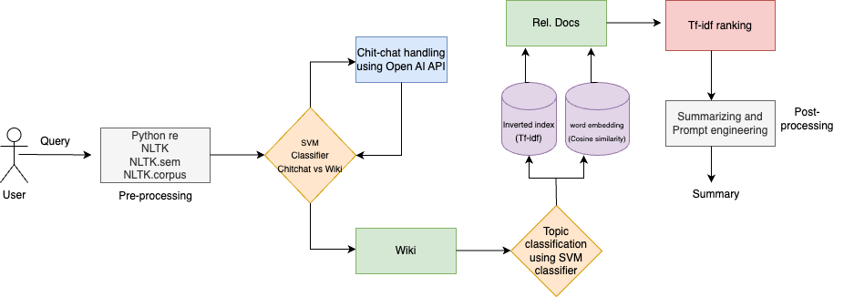

> **CSE** **4/535** **-** **Introduction** **to** **Information**
> **Retrieval** **-** **Fall** **2024** **Project** **3**

**Team:**

Sai Venkat Reddy Sheri (ssheri, 50545752) Praneeth Posina (leelasat,
50540667) Swetha Reddy Ganta (sganta3, 50539689)

**Introduction:**

The project is about creating an end-to-end Information Retrieval
chatbot that can intelligently answer user queries using information
from Wikipedia scraped documents. It can handle diverse conversations
across various topics like health, technology, travel etc. by
integrating web scraping, indexing and query handling It can also
perform general conversations or casual talks..

To build this chatbot, we developed a web scraper that gathers and
indexes a dataset of more than 60,000 documents and classifies the
topics to give accurate query responses. In addition, the chatbot
includes strong exception handling to handle mistakes seamlessly and
provide analytical insights through visualizations based on the
conversations in the user interface.

**Methodology:**

This
architecture outlines the process of building a chatbot capable of
handling both general conversations (chit-chat) and answering questions
using information from Wikipedia documents. Each step in the system
plays an essential role in ensuring the chatbot works smoothly and
accurately. Here's how it works:

**1.** **Preprocessing**

The preprocessing stage prepares user queries for classification and
retrieval. The following methods were used:

**Tokenization,** **Stemming,** **and** **Lemmatization** **using**
**Natural** **Language** **Toolkit** **(NLTK)**: This involves breaking
the text into smaller parts, reducing words to their base forms, and
standardizing them for analysis.

**Stop-word** **Removal**: In this step, we filter out most common words
like "the" and "is" that don’t add much meaning.

**Python** **Regular** **Expressions** **(re)**: Further, we used the re
model in Python to clean and normalize text by identifying specific
patterns, such as removing special characters or formatting
inconsistencies.

**Semantic** **Analysis** **(NLTK.sem)**: This includes using advanced
tools to analyze the meaning of the text and reference large language
databases. It is useful for understanding relationships and context
within the text.

**Access** **to** **Linguistic** **Corpora** **(NLTK.corpus)**: The
corpus module in NLTK provides access to a collection of precompiled
text datasets, such as word lists, dictionaries, and linguistic corpora.
These datasets are valuable for tasks like language modeling and text
analysis.

This step ensures the query is clean and structured, laying the
foundation for accurate classification and document retrieval.

**2.** **Chit-chat** **vs.** **Wiki** **Classification**

A **Support** **Vector** **Machine** **(SVM)** classifier, trained on
labeled datasets, determines if the query is for chit-chat or
informational (Wiki) purposes.

For instance, some queries were marked as chit-chat (like "How’s the
weather today?") and others as Wiki-based (like "Tell me about balanced
diet”- coms under health topic). By learning the patterns and
differences in these queries, the SVM can classify new, unseen queries
into one of these two categories.

Additionally, a dropdown menu is added through User Interface (UI) for
selection between General Conversation (Chit-chat), Self-Operating
Classifier (Classifier predicts the type of query whether chitchat or
not), Multi Topic (Can answer muti topic queries), and all the topics .
This allows us to manually select among multiple options provided.

**3.** **Chit-chat** **Handling**

After the system processes the user’s query and determines it’s a
chit-chat request through the SVM classifier, or by manual selection in
UI it moves on to the **chit-chat** **handling** **module**.

The system’s first major task after preprocessing the query is to figure
out whether the user wants to have a general conversation (chit-chat) or
is looking for factual information (Wiki-based query). To achieve this,
a Support Vector Machine (SVM) classifier is used.

This module is designed to manage casual, open-ended conversations with
the user, such as answering questions like, “How’s your day?” or “What’s
your favorite book?”

To handle these types of conversations, the chatbot relies on the
**OpenAI** **API**, which is well-known for its advanced language
generation capabilities. The API enables the chatbot to provide
responses that feel natural, friendly, and engaging, making smooth
interactions.

For example, if the user says something like, “Tell me a joke,” the
chatbot uses the OpenAI API to generate a witty and humorous reply.

Similarly, it can respond
thoughtfully to statements like, “I’m feeling tired today.”

This approach's ability to generate dynamic and context-aware responses
is one of its main advantages. The OpenAI API may produce a huge number
of responses that seem customized for the discussion. But in rule-based
systems that may rely on pre-written responses. This shows the chatbot
is versatile and able to adapt to different styles of user interaction.

With this, the users who want to have a general and fun conversation
with chatbot can have a seamless experience.

**4.** **Topic** **Classification**

If the system determines that a query is informational and related to
Wikipedia content (through the chit-chat vs. Wiki classifier), it needs
to further narrow down what the query is about. This is where **Topic**
**Classification** comes in.

In this step, the system uses the same **Support** **Vector**
**Machine** **(SVM)** **classifier** to identify the specific topic of
the query.

For example, if a user asks, “What is the use of solar energy?”, the
classifier would recognize this as related to the **Environment** topic.

The
associated document IDs:

Similarly, a query like, “What are the symptoms of Migraine?” would be
categorized under **Health**. But in our experiments, we got an accuracy
of 80% while choosing the ‘self-operating classifier’. To get better
results, choosing the topic directly helps.

> Fig: List of topics to choose from

This classification process is important because Wikipedia contains vast
amounts of information on countless topics. By narrowing the query to a
specific category, the system can focus on retrieving documents that are
highly relevant to the user’s question. This saves time and ensures that
the retrieved information is accurate and specific, rather than being
too broad or unrelated.

The SVM classifier used here was trained on labeled datasets that
include queries categorized by topics like **Health**, **Environment**,
**Technology**, **Food** **etc**. During the training phase, the system
learned the patterns in these queries — for instance, recognizing that
terms like “medicine” or “disease” often relate to **Health**, while
words like “software” or “AI” are more likely to belong to
**Technology**.

By accurately identifying the topic, the system can streamline the next
steps, such as document retrieval. Instead of searching through all
available data, it searches only within the subset of

documents that match the topic. This not only improves the speed of the
process but also enhances the quality of the final answer provided to
the user.

Ultimately, this step ensures that the chatbot delivers targeted,
topic-specific responses, making the user experience more efficient and
satisfying. Whether the query is about health advice, environmental
issues, or technological advancements, the system is equipped to handle
it with precision.

**5.** **Document** **Retrieval** **with** **Inverted** **Index**

We used two techniques—**TF-IDF** and **Cosine** **Similarity**—to find
the most relevant documents based on their queries.

**1.** **TF-IDF** **(Term** **Frequency-Inverse** **Document**
**Frequency):**

This technique is all about identifying the importance of words (terms)
in a document relative to the entire collection of documents (corpus).

> ● **Term** **Frequency** **(TF):** It measures how often a term
> appears in a document. Words that occur frequently are assumed to be
> important within that document.
>
> ● **Inverse** **Document** **Frequency** **(IDF):** It reduces the
> weight of terms that are common across many documents, like "the" or
> "is," because such terms are less helpful in distinguishing one
> document from another. By combining TF and IDF, the system assigns a
> weight to each term, emphasizing words that are both frequent in a
> document and rare across the corpus. This helps the system rank
> documents by their relevance to the query.

**2.** **Cosine** **Similarity:**

Once the system has represented documents and the query as numerical
vectors (using Sbert or sentence transformers library), it calculates
**Cosine** **Similarity** to determine how closely the query matches
each document:

> ● Cosine Similarity measures the angle between the query vector and
> document vectors. If the vectors point in the same direction (i.e.,
> the angle is small), the similarity is high, meaning the document is
> more relevant.
>
> ● This method ensures that documents with terms closely aligned to the
> query are ranked higher, even if the query and document lengths
> differ.

**3.** **The** **Role** **of** **the** **Inverted** **Index:**

An **inverted** **index** acts as the backbone of the retrieval process.
During preprocessing, the system creates this data structure, which maps
each term in the corpus to a list of documents where the term appears.
Think of it as a reverse lookup table for words:

> ● When a user submits a query, the system can instantly identify which
> documents contain the query terms by consulting the inverted index.
>
> ● This dramatically speeds up the retrieval process, as the system
> doesn’t need to scan every document—it only focuses on those linked in
> the index.

**6.** **Re-ranking** **Retrieved** **Documents**

After the initial retrieval of documents using TF-IDF and Cosine
Similarity, the system doesn't stop there. It takes the extra step of
**re-ranking** the documents to refine their relevance scores. This
involves recalculating and combining TF-IDF scores and Cosine Similarity
measures for each document in relation to the user’s query.

> ● **Why** **re-rank?** The first pass might bring in documents that
> are roughly relevant but not perfectly ordered by relevance.
> Re-ranking allows the system to fine-tune the priority of documents,
> ensuring the most pertinent ones are pushed to the top.
>
> ● **How** **it** **works:** Each document is assigned a new composite
> score based on its initial retrieval metrics. The system applies
> additional weighting or filters during this step to better align
> results with the query context or user preferences.

This ensures that the most meaningful documents are presented first,
setting the stage for effective post-processing.

**7.** **Post-processing**

Once the most relevant documents are identified and ranked, the system
shifts its focus to delivering a final response that’s user-friendly and
actionable. This stage involves two key tasks:

**A.** **Document** **Summarization**

The system uses **generative** **techniques** to condense large volumes
of text into concise summaries. Instead of confusing the user with raw
data, it highlights the essential points from the top-ranked documents.

Open AI API (GPT Model) extracts the main ideas and presents them in a
coherent summary. This saves users time by cutting through the clutter
and providing a digest of the key information.

**B.** **Prompt** **Engineering** **for** **Precise** **Answers**

In some cases, users need direct answers rather than summaries. For
this, we introduced **prompt** **engineering** into the project which
involves carefully designed prompts to extract specific, contextually
accurate responses from the retrieved content.

> ● For instance, if a user asks, "What is the capital of France?", the
> system bypasses general summaries and directly pinpoints "Paris" from
> the retrieved documents.

> ● This process ensures that answers are tailored to the user's query
> and presented in a way that’s easy to understand.

**Analytics:**

The following images depict the real-time analytics of the chatbot
through three visualizations:

> 1\. Questions asked on different Topics provide a graphical
> representation in the form of a bar graph about the number of queries
> made on each topic in the corpus.
>
>  style="width:5.9375in;height:2.70833in" />2. Chit Chat and Topic
> distribution pie chart depicts General conversation vs Topic
> Conversations which represents queries made on each segment.

> 3\. Queries asked every second show a line graph on the number of
> queries made per each second, with more traffic the values of queries
> increases which can be used to monitor the traffic.

**Conclusion:**

To simply put, the system tokenizes and pre-process the query, and
searches it in the tf-idf index and gets 2-3 documents. If the given
query doesn't have the tokens that directly matches with the documents
then it goes to cosine similarity and finds the most similar documents
using cosine similarity score and then gets the the document. If there
are multiple documents which match the query in TF IDF, those multiple
documents are fetched and they are ranked according to the TF IDF
scores. The top two documents are taken and these documents are either
from TF IDF inverted index or cosine similarity will be given to the
summarizer and that summarizer will find out the exact answer only
within the document and returns the answer.

**Team** **contribution:**

||
||
||
||
||
||
||
